<h3>Dans ce projet,on a commence par la notion de l'heritage</h3>
<h4>On a Les 2 classes CurrentAccount et SavingAccount heritent de la classe BankAccount
</h4>
<h3> Il y'a trois solutions (Trois Strategies) pour mapper  l'heritage</h3>
<h2>1- Single Table :</h2>

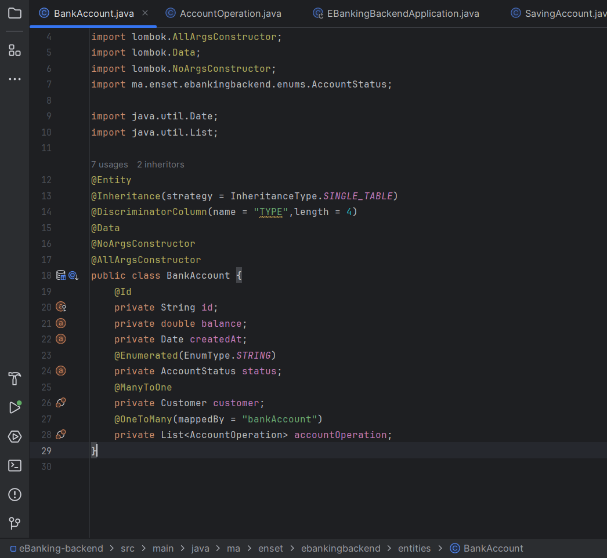

<h4>On specifie le type d'heritage en utilisant @Inheritance(strategy = InheritanceType.SINGLE_TABLE)</h4>

<h4>-on aura une seul table qui va regrouper tout les attribue de 	la classe BankAccount ainsi que l attribut de  		CurrentAccount et celui de SavingAccount et on va ajouter 	un autre attribuer TYPE (it's a Discrimination column) pour 	spesifier le type du compte (CurrentAccount CC ou 	SavingAccount SA ).</h4>

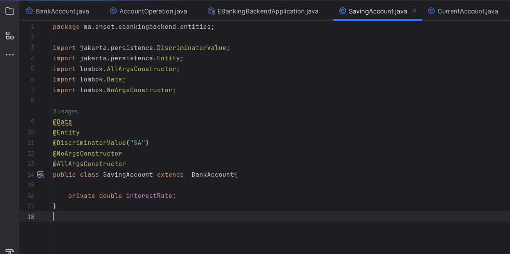
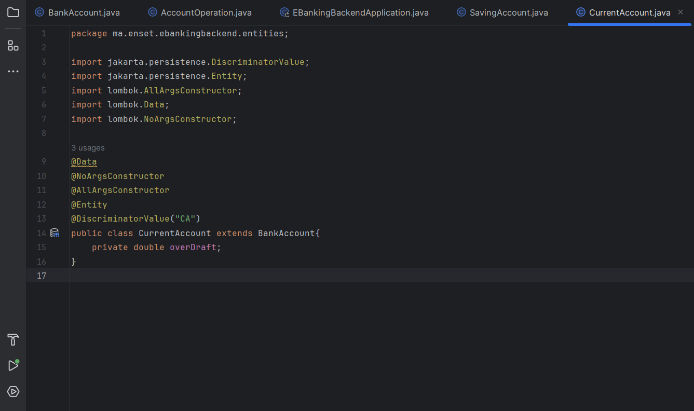
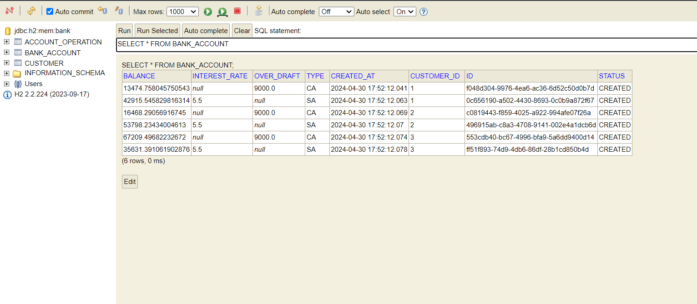
<h2>2- Table Per Class :</h2>
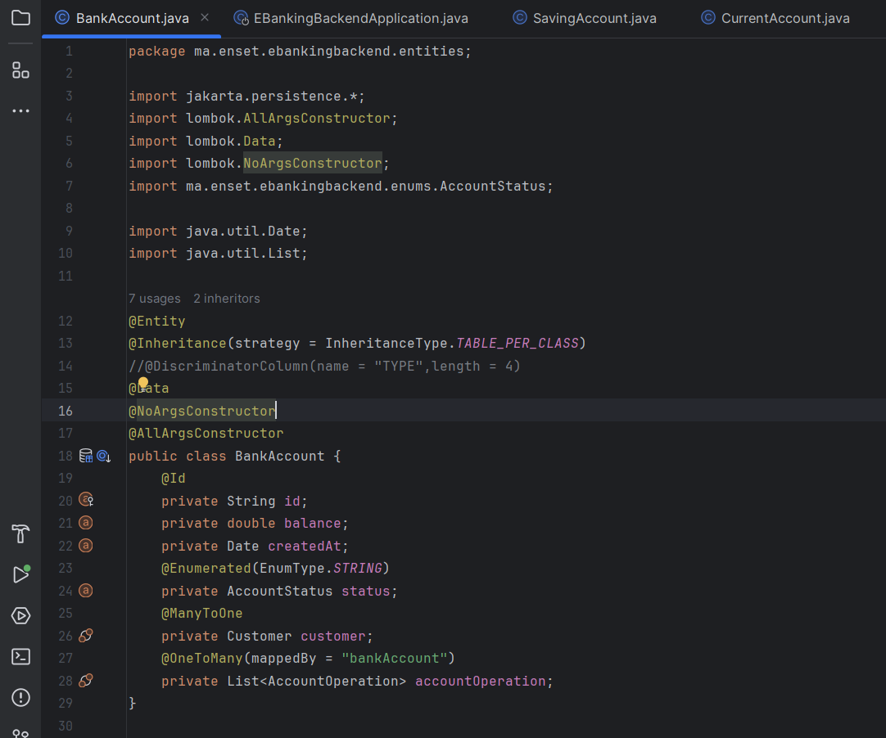
<h4>-On aura 2 tables , La table CurrentAccount et La table 	SavingAccount
	on separe les 2 compte CC et SA</h4>
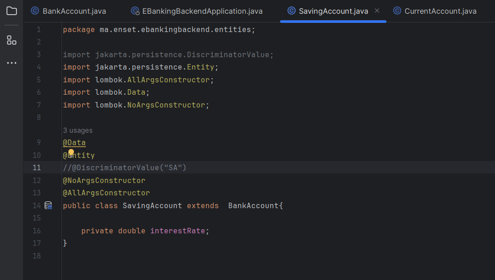
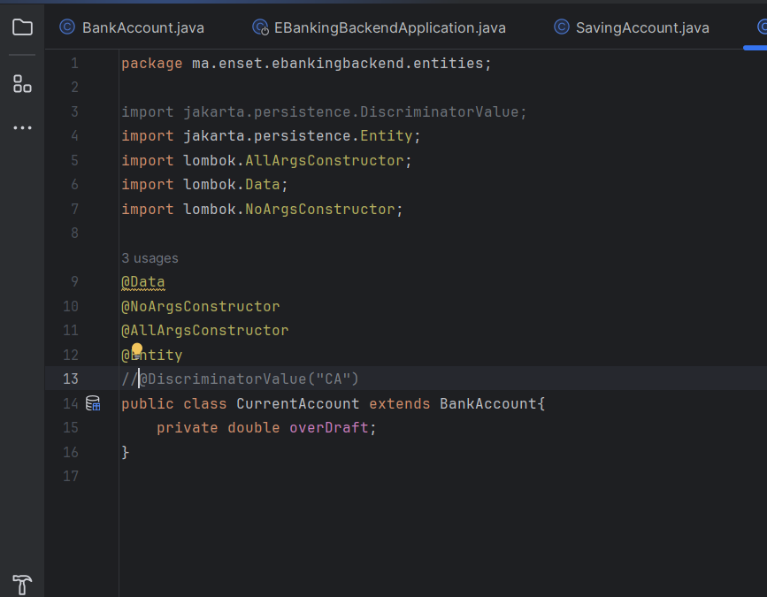

<h2>3- Joined Table :</h2>

<h4>	- on va creer trois Tables, une table Account qui contiendra que les attributs communes , une table currentAccount qui contiendra que le overDraft et la table SavingAccount qui contiendra Rate,
on liera les tables apres en ajoutant Acc_ID dans les tables SavingAccount et currentAccount</h4>

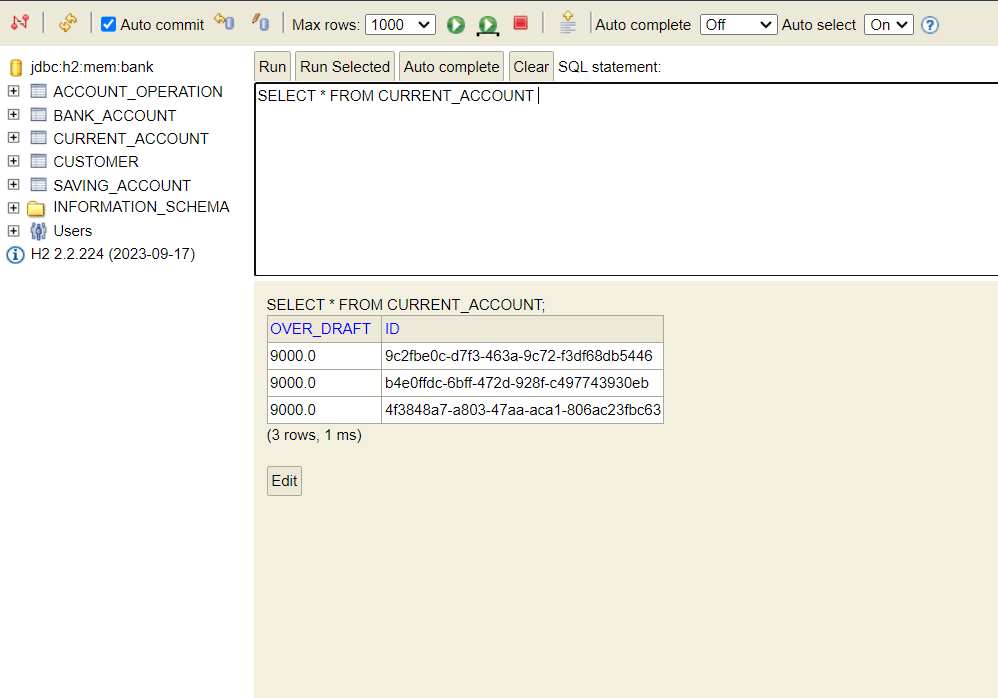
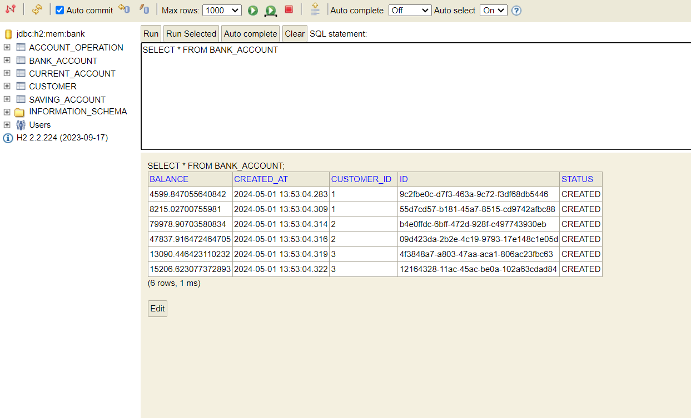
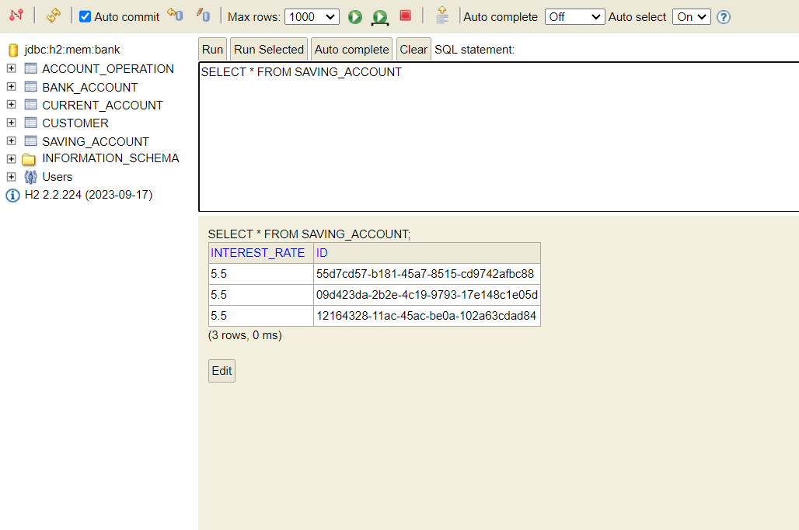

<h4>si on veut basculer de single table a Table Per Class on change @Inheritance(strategy = InheritanceType.SINGLE_TABLE) par @Inheritance(strategy = InheritanceType.TABLE_PER_CLASS)
</h4>

<h4>La methode pour retourner la liste des Customers </h4>
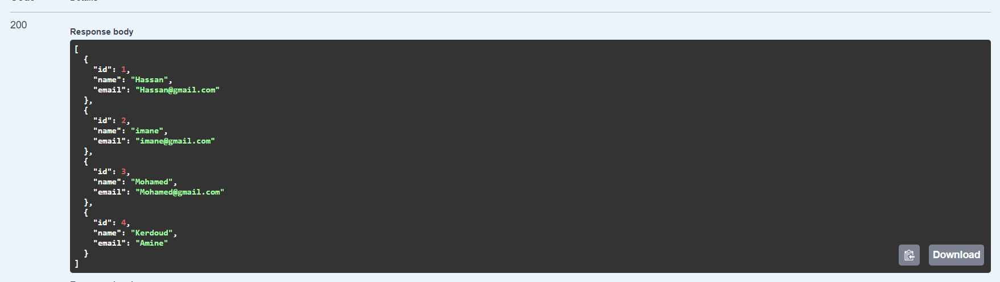
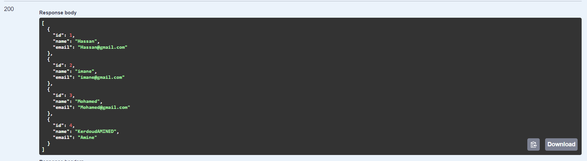

<h4>La methode pour retourner un Customer selon id </h4>
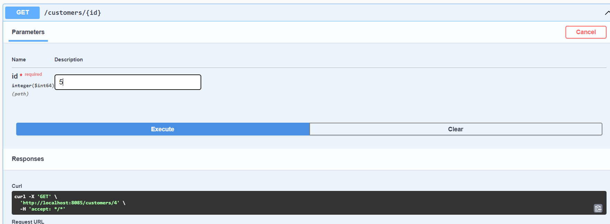
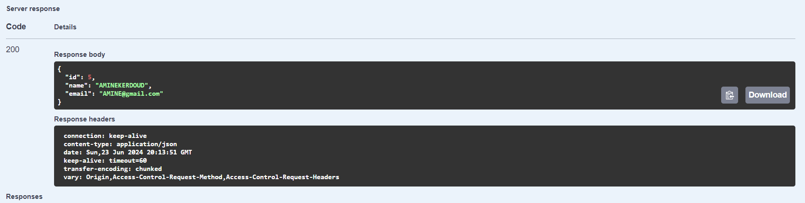

<h4>La methode pour retourner les comptes </h4>
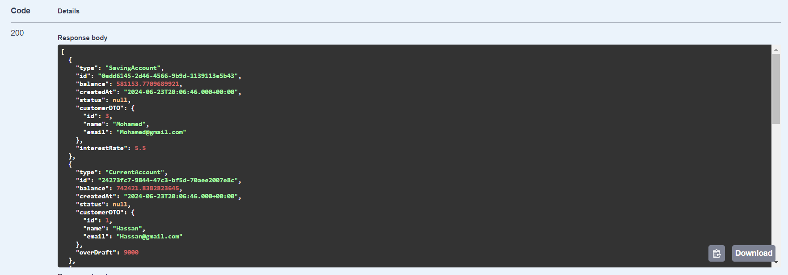

<h4>La methode pour retourner un compte selon l'id </h4>
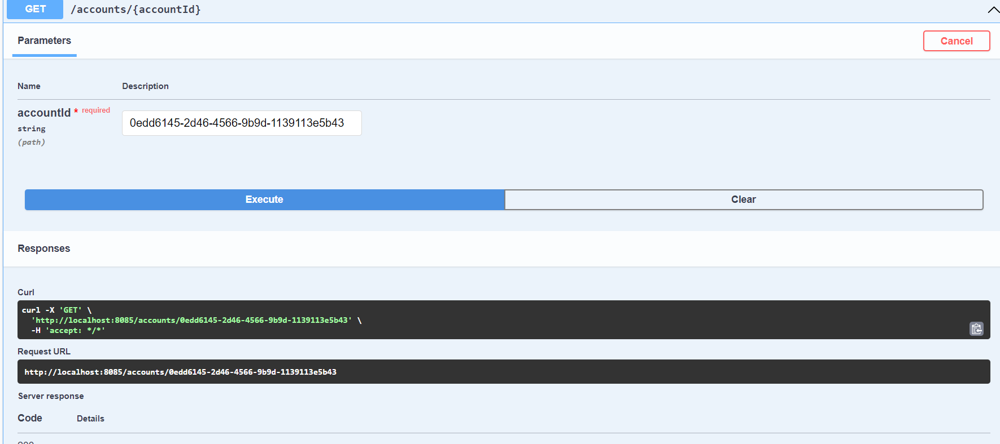
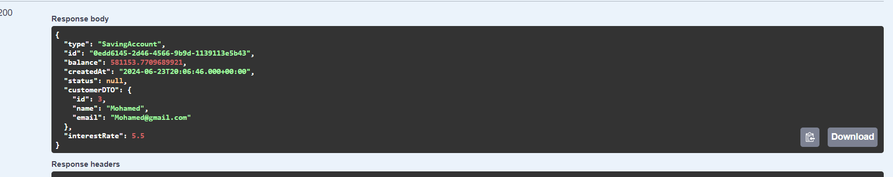

